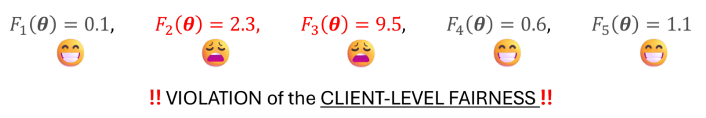

<div align="center">
  <h1 align="center">(𝙰𝙰𝚐𝚐𝙵𝙵) Pursuing Overall Welfare in Federated Learning <br> through Sequential Decision Making</h1>

### [ICML`24](https://proceedings.mlr.press/v235/hahn24a.html) | [Poster](./assets/AAggFF_Poster.pdf) | [Paper](https://arxiv.org/abs/2405.20821) | [Video](https://youtu.be/HwzcV645Xoc?list=PLTlQ809nH5xsdYaTyfsXbM6_gkzerxW8j) | [Thread (X)](https://x.com/vaseline_555/status/1814694180435993044)

</div>

<div align="center">

</div>

## TL; DR
<u>The server-side sequential decision-making</u> framework for the performance uniformity in practical federated settings by constructing <u>adaptive mixing coefficients</u> used to aggregate local updates.
* See also <i>Agnostic Federated Learning</i> ([AFL](https://arxiv.org/abs/1902.00146) &ndash; ICML`19) (i.e., min-max optimization; distributionally-robust optimization) &mdash; 𝙰𝙰𝚐𝚐𝙵𝙵 can be regarded as a rectified version of AFL.
* See also <i>Tiltied Empirical Risk minimization</i> ([TERM](https://openreview.net/forum?id=K5YasWXZT3O) &ndash; ICLR`21) &mdash; 𝙰𝙰𝚐𝚐𝙵𝙵 can be viewed as an online version of TERM.


## Reproduce Experiments
#### Setup 
```
pip install -r requirements.txt
```
> Implemented with: ( Ubuntu 20.04 LTS | Python 3.10.3 | CUDA 11.4 | cuDNN 8.3.2 )


#### Run
```
# to see all arguments
python main.py -h

# e.g., cross-silo setting
sh commands/cross_silo/berka/main_berka.sh
...

# e.g., cross-device setting
sh commands/cross_device/celeba/main_celeba.sh
...
```
> Don't worry, all the data will be downloaded automatically in the specifid path.

## Essence
* See `./server/aaggffserver.py` with comments.
* You may change the decision loss, different OCO framework (or `bandits`, or even `reinforcement learning` setting).
> If you find any interesting directions, please drop me a line for collaboration!

## License
* For non-commercial use, this code is released under the [MIT LICENSE](./LICENSE).  
* For commercial use, please contact <u>Seok-Ju (Adam) Hahn</u> ([sjhahn11512@gmail.com](mailto:sjhahn11512@gmail.com)).


## Citation

```BibTeX
@article{hahn24aaggff,
  title={Pursuing Overall Welfare in Federated Learning through Sequential Decision Making},
  author={Hahn, Seok-Ju and Kim, Gi-Soo and Lee, Junghye},
  booktitle={Proceedings of the 41st International Conference on Machine Learning},
  pages={17246--17278},
  year={2024},
  publisher={Proceedings of Machine Learning Resaerch, PMLR}
}
```
